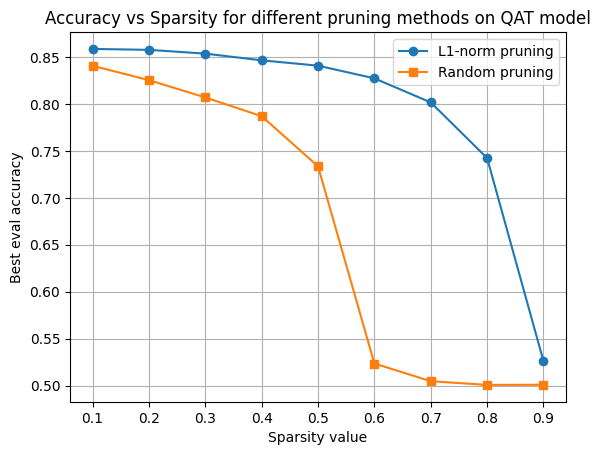

### Authors: Jun Tan, Souparna Mandal, Clarence Ong, Tanson Tang


# Lab 1: Model Compression (Quantization and Pruning)

## Task 1
| Quantisation Level (Fraction width) | PTQ Accuracy | QAT Accuracy |
|:--------------------:|:-------------:|:--------------:|
| 4 (2)                 | 0.50000      | 0.50000       |
| 8  (4)                | 0.79808      | 0.83936       |
| 12 (6)                | 0.83492      | 0.84160       |
| 16 (8)               | 0.83472      | 0.84192       |
| 20 (10)               | 0.83580      | 0.84192       |
| 24 (12)                | 0.83556      | 0.84192       |
| 28 (14)                | 0.83556      | 0.84176       |
| 32 (16)                | 0.83564      | 0.84192       |


We identified that with 12-bit quantisation (6 bit of fraction width length) as the elbow point of the graph, which gives the best PTQ accuracy out of all runs, and reached identical performance on QAT accuracy compared to higher fixed-point width runs.

## Task 2
Based on Part 1, we decided to use the model with quantisation level of 12 with 6 bits fraction bit length for this task.

| Sparsity level |   L1-norm   |  Random   |
|:---------------:|:------------:|:---------:|
| 0.1            |      0.85868      |     0.84072     |
| 0.2            |      0.85768      |     0.82544     |
| 0.3            |      0.85368     |     0.80696     |
| 0.4            |      0.84652      |     0.78704     |
| 0.5            |      0.84084      |     0.73360     |
| 0.6            |      0.82732      |     0.52348    |
| 0.7            |      0.80168      |     0.50464     |
| 0.8            |      0.74236      |     0.50068     |
| 0.9            |      0.52600      |     0.50084     |




The best Pruning result in terms of evaluation accuracy for both ```L1-Norm``` and ```Random``` methods happened when sparsity is set to 0.1. As sparsity value increases, the model's evaluation accuracy reduces, particularly for ```L1-Norm``` method sharp drop occured between 0.8-0.9, while for ```Random``` method sharp drop happended eariler between 0.5-0.6. This can be explained as more weights and connections are dropped in high sparsity values, the BERT model will not be able to learn the representation of the network effectively.
# Lab 2: Neural Architecture Search

# Lab 3: Mixed Precision Search

# Lab 4: (Software Stream) Performance Engineering