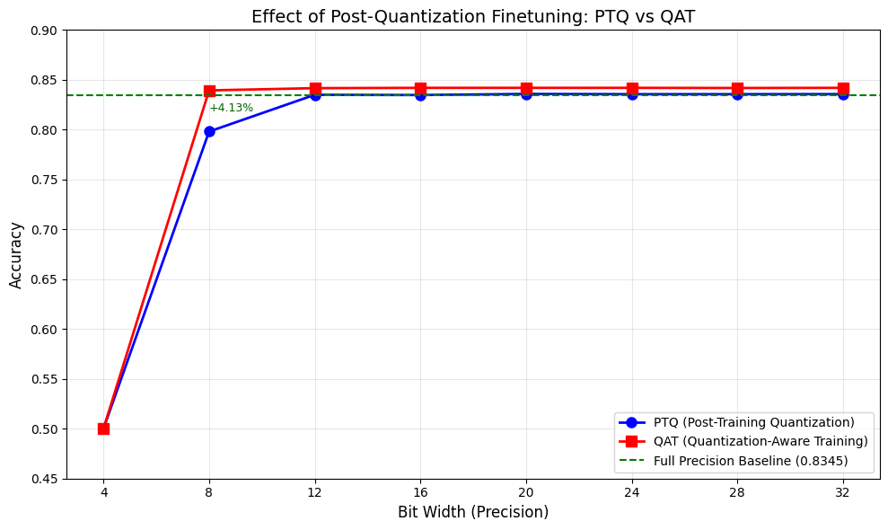
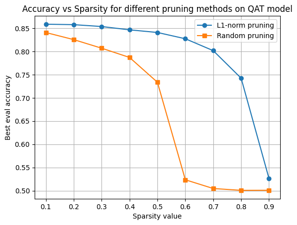
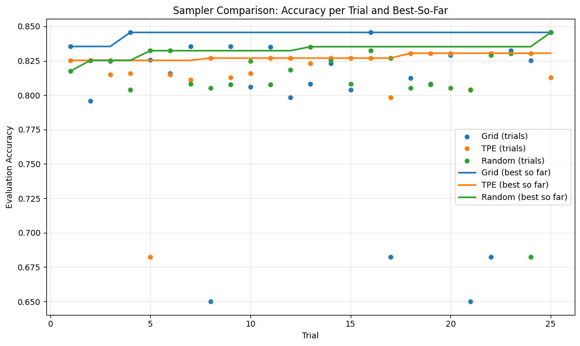
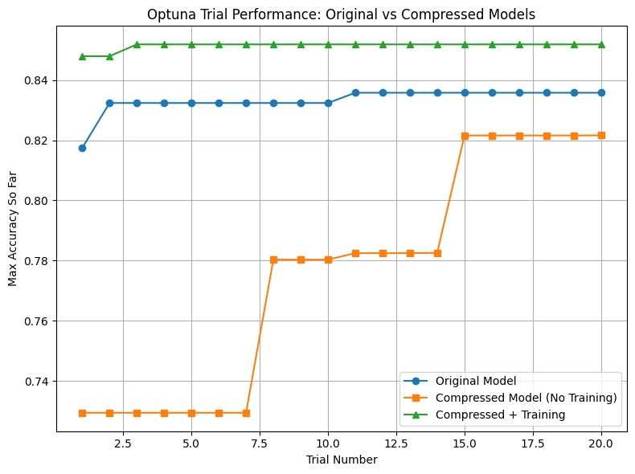
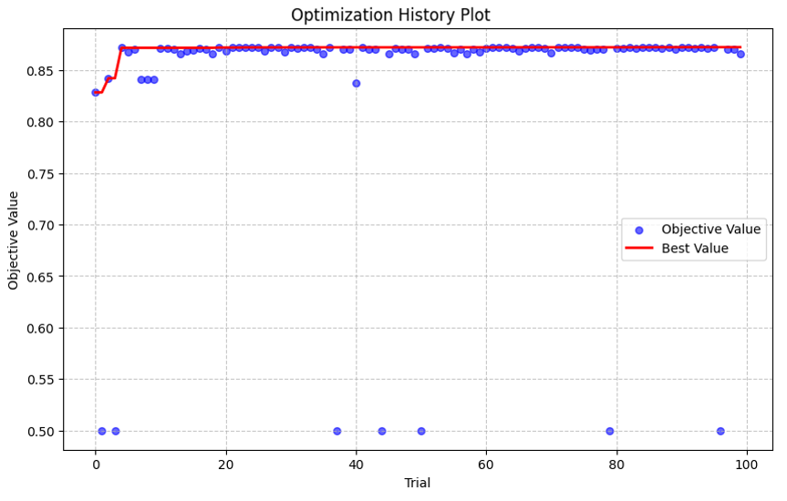
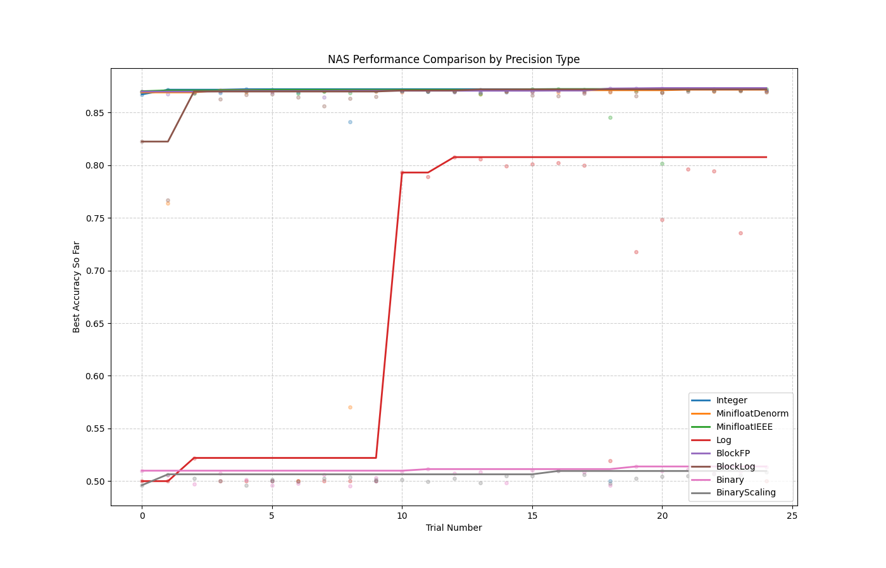
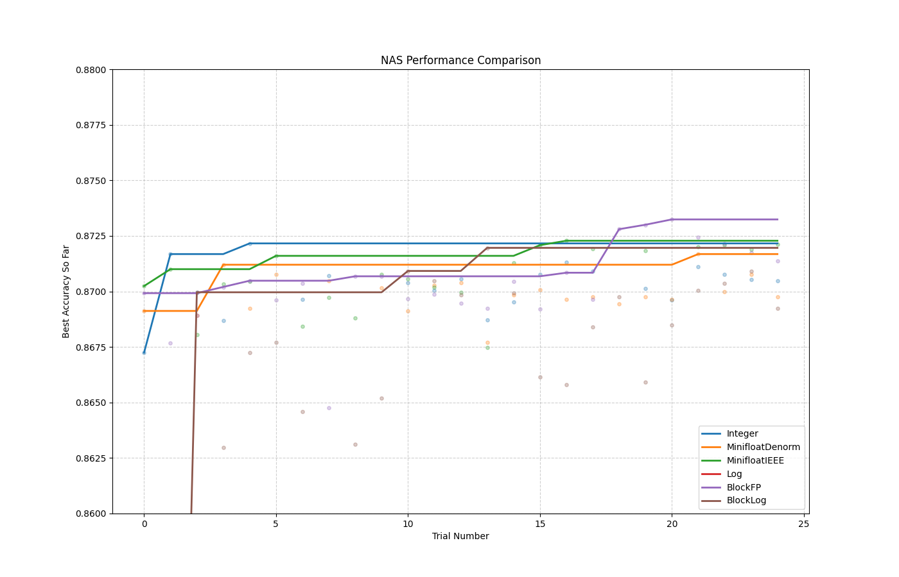
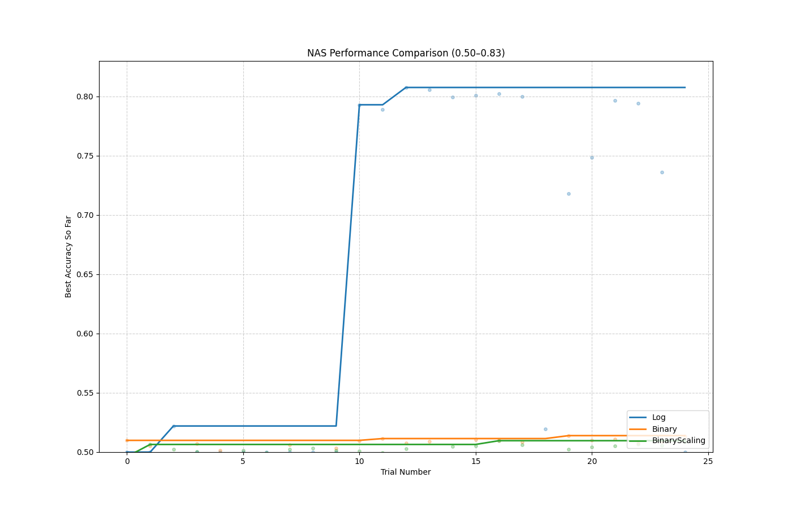

### Authors: Jun Tan, Souparna Mandal, Clarence Ong, Tanson Tang


# Lab 1: Model Compression (Quantization and Pruning)

## Task 1
| Quantisation Level (Fraction width) | PTQ Accuracy | QAT Accuracy |
|:--------------------:|:-------------:|:--------------:|
| 4 (2)                 | 0.50000      | 0.50000       |
| 8  (4)                | 0.79808      | 0.83936       |
| 12 (6)                | 0.83492      | 0.84160       |
| 16 (8)               | 0.83472      | 0.84192       |
| 20 (10)               | 0.83580      | 0.84192       |
| 24 (12)                | 0.83556      | 0.84192       |
| 28 (14)                | 0.83556      | 0.84176       |
| 32 (16)                | 0.83564      | 0.84192       |




We identified that with 12-bit quantisation (6 bit of fraction width length) as the elbow point of the graph, which gives the best PTQ accuracy out of all runs, and reached identical performance on QAT accuracy compared to higher fixed-point width runs.

## Task 2
Based on Part 1, we decided to use the model with quantisation level of 12 with 6 bits fraction bit length for this task.

| Sparsity level |   L1-norm   |  Random   |
|:---------------:|:------------:|:---------:|
| 0.1            |      0.85868      |     0.84072     |
| 0.2            |      0.85768      |     0.82544     |
| 0.3            |      0.85368     |     0.80696     |
| 0.4            |      0.84652      |     0.78704     |
| 0.5            |      0.84084      |     0.73360     |
| 0.6            |      0.82732      |     0.52348    |
| 0.7            |      0.80168      |     0.50464     |
| 0.8            |      0.74236      |     0.50068     |
| 0.9            |      0.52600      |     0.50084     |




The best Pruning result in terms of evaluation accuracy for both ```L1-Norm``` and ```Random``` methods happened when sparsity is set to 0.1. ```L1-Norm``` outperforms ```Random``` as sparsity value increases, where even with a high sparsity value (0.7-0.8), the model is still able to retain 0.80 accuracy.   

As sparsity value increases, the model's evaluation accuracy reduces, particularly for ```L1-Norm``` method sharp drop occured between 0.8-0.9, while for ```Random``` method sharp drop happended eariler between 0.5-0.6. This can be explained as more weights and connections are dropped in high sparsity values, the BERT model will not be able to learn the representation of the network effectively. 
# Lab 2: Neural Architecture Search

## Task 1



We did a sweep for all three different samplers, with 25 trials each. Due to the computational constrain and time needed for the training to complete, we picked 25 trials instead of the recommended 100 trials, and aiming to find a local minimiser, ie the best performance architecture out of the 25 trials with each sampler. 

Based on the graph, GridSampler managed to find the best architecture that gives the highest accuracy, while TPESampler is gradually increasing the accuracy of the model, but not returning the best after 25 trials. On RandomSampler it managed to find the similar architecture that GridSampler did on the 25th trial, but due to it randomness, nothing is guaranteed.

Another thing to note is the search space consists of 300 unique combinations, thus sweeping all the combinations with GridSampler is a time and computational costly process, which also supports the best accuracy shown above is just the optimal within the 25 trials. 


## Task 2


The plot above compares the best accuracy achieved over the number of trials for three cases: the best model from Task 1 without compression, compression-aware search without post-compression training, and compression-aware search with post-compression training.

The compression-aware search without post-compression training consistently underperforms the uncompressed baseline, indicating that quantization and pruning introduce an immediate degradation in accuracy when no further adaptation is allowed. In contrast, enabling post-compression training not only recovers this loss but leads to a compressed model that outperforms the original uncompressed model.

This result suggests that jointly optimising architecture and compression encourages the discovery of models that are inherently more robust to quantization and pruning. Furthermore, post-compression training allows the model to adapt effectively to the constrained parameter space, resulting in improved generalisation and higher final accuracy despite the reduced model precision and size.


# Lab 3: Mixed Precision Search
## Part 1

After running 100 trials with Optuna TPESampler, the maximum achieved accuracy is found to be 0.87216. The plot also shows the best accuracy was reached within the first 10 trials, with the remaining trials attempting to improve but no better parameters were found. Also, the Neural Architecture search in this case was able to find different quantisations for different layers, and this was more optimal than having the same quantisation on all layers, as we performed better than the benchmark model from task2.



## Part 2
The experiment was setup to run 25 optuna trials, with the TPESamples, where the search space was constricted to a 2 linear layer choices similar to Part 1, but this time with we ran 8 different studies with following supported precisions for the linear layers: 

| Study (precision variant) | Linear layer Search Space | Supported precision values (from Tutorial 6) |
|---|---|---|
| Integer | `torch.nn.Linear` / `LinearInteger` | bit-width \(W\) = [8, 16, 32]; frac-width \(F\) = [2, 4, 8] |
| MinifloatDenorm | `torch.nn.Linear` / `LinearMinifloatDenorm` | total width \(W\) = [8, 16, 32]; exponent width \(E\) = [2, 4, 8]; exponent bias = `None` |
| MinifloatIEEE | `torch.nn.Linear` / `LinearMinifloatIEEE` | total width \(W\) = [8, 16, 32]; exponent width \(E\) = [2, 4, 8]; exponent bias = `None` |
| Log | `torch.nn.Linear` / `LinearLog` | bit-width \(W\) = [8, 16, 32]; exponent bias = [-1, 0, 1] |
| BlockFP | `torch.nn.Linear` / `LinearBlockFP` | width \(W\) = [4, 8, 16]; exponent width \(E\) = [4, 8, 16]; block size = [8, 16, 32] |
| BlockLog | `torch.nn.Linear` / `LinearBlockLog` | bit-width \(W\) = [8, 16, 32]; shared exponent-bias width = [2, 4, 8]; block size = [8, 16, 32] |
| Binary | `torch.nn.Linear` / `LinearBinary` | binary (1-bit) weights; stochastic = [0, 1]; bipolar = `True` |
| BinaryScaling | `torch.nn.Linear` / `LinearBinaryScaling` | binary (1-bit) data/weights/bias; stochastic = [0, 1]; bipolar = `True`; `binary_training` enabled |

The plot below shows the maximum achieved accuracy for each study, with the number of trials on the x axis, and the maximum achieved accuracy up to that point on the y axis. We have multiple curves, showing the maximum achieved performance at different scales.

**Performance Comparison for all suported linear layer precisions**


<table>
  <tr>
    <td align="center" width="50%">
      <b>Figure 2a: High-performing Linear layers (0.86–0.88)</b><br>
      
    </td>
    <td align="center" width="50%">
      <b>Figure 2b: Mid/low-performing Linear layers (0.50–0.83)</b><br>
      
    </td>
  </tr>
</table>

A summary of the best performing linear layers for each precision variant can be found below:

| Precision Type | Best Accuracy | Best Trial ID |
|---|---:|---:|
| BlockFP | 0.87324 | 20 |
| MinifloatIEEE | 0.87228 | 16 |
| Integer | 0.87216 | 4 |
| BlockLog | 0.87196 | 13 |
| MinifloatDenorm | 0.87168 | 21 |
| Log | 0.80764 | 12 |
| Binary | 0.51392 | 19 |
| BinaryScaling | 0.50964 | 16 |

This clearly shows that the BlockFP Layer quantisation performs the best, with the highest accuracy of 0.87324, followed by MinifloatIEEE, and Integer quantisations. The best performing linear layer choices and quantisations for the BlockFP precision (best trial = 20) are:

- **BlockFP config**: `W=4`, `E=4`, `exponent_bias=None`, `block_size=8`
- **Layers changed to BlockFP to**: `L0.query`, `L0.key`, `L0.attn_out_dense`, `L0.ffn_out_dense`, `L1.value`, `L1.ffn_out_dense`, `classifier`
- **Layers retained with FP32**: `L0.value`, `L0.ffn_intermediate`, `L1.query`, `L1.key`, `L1.attn_out_dense`, `L1.ffn_intermediate`, `pooler_dense`

```
Input
  │
Encoder layer 0:
  Q,K = BlockFP; V = FP32
  Attention output dense = BlockFP
  FFN intermediate = FP32; FFN output dense = BlockFP
  │
Encoder layer 1:
  Q,K = FP32; V = BlockFP
  Attention output dense = FP32
  FFN intermediate = FP32; FFN output dense = BlockFP
  │
Pooler dense = FP32
  │
Classifier dense = BlockFP
```

A thing to note about the experiment is that it is limited to trying between only 2 linear layer quantisation choices in every study, and also we were restricted by computuational resources restricting our number of trials to only 25. Running expeirments with more number of trials can lead to finding better performing quantisations for some of the layers, and may even lead to the mid/low performing layers to perform close to our original unquantised baseline model. Similarly running a study with the search space spanning all the possible linear layer quantisation may be computationally expensive but can lead to finding the best performing model.

This part is an effective display that different layers in the Neural network may be quantised with a different precision or precision type to achieve the best performance, given adequate computational resources to perform the hyper-parameter search. 

# Lab 4: (Software Stream) Performance Engineering

### Task 1

The experiments below were conducted on Colab, using the L4 GPU Runtime.

a) ```torch.compile``` compiles PyTorch code into optimized kernels that significantly speed up inference. This feature relies on **TorchDynamo** to compile the code into torch fx graphs using a JIT compiler and **TorchInductor** to further compile the fx graphs into optimized kernels.

In this task, the device is set to CPU, and the runtime comparison is:

```
Original model: 1.6215 s
Optimized model: 7.1436 s
```

The optimised model in this case actually runs slower than the original model, this can be explained as the overhead of the JIT compiler and the compilation process itself is not worth the performance gain from the optimised kernels, especially as we run the model inference on CPU for only 5 times. 

The optimised model on average can perform better if we run the model for a large number of times, where the cost of initial compilation is amortised over the entire inference process. To test this, we ran the model with $n=20$ and the runtime comparison is:

```
Original model: 1.7296 s
Optimized model: 1.2245 s
```

This supports our hypothesis.


b) In this task the device is set to CUDA, and the runtime comparison for average model runtime (one forward pass/ inference) for 5 runs is:
```
Original model: 0.0902 s
Optimized model: 3.5635 s
```
It can see that the optimised model runs significantly slower than the original model, this can be explained with a similar argument as part a) of this task, where the cost of initial compilation is a lot, and the optimisation is thus not worth it as we are only running 5 inferences. 

Another observation is the the Optimized model also runs slower than the CPU run models. This can be explained as warm-up cost / initial compilation now is more as compared to the CPU, as the compilation now is now done for a more complex hardware target (the GPU).

Going into more detail, the ```torch.compile```'s process **TorchDynamo**'s role remains unchanged compared to the CPU model, but now the **TorchInductor** part of the process, involves more complex optimisation processes to map the Fx graph into optimized CUDA kernels, which takes more time, and thus can explain the slower runtime, even compared to the CPU models. Basically the warm-up time is now a lot more as compared to the warm-up time of the CPU models.

To verify the claim, we ran the model with $n=20$ and the runtime comparison is:
```
Original model: 0.0563 s
Optimized model: 0.0426 ss
```

THis supports our hypothesis once again, as the initial compilation / warmup time is now amortised over 20 inference calls rather than just 5. 

Thus, it makes sense to use ```torch.compile``` to optimise the model when running the model for a large number of inferences / forward passes, etc, which is the case in most real-world applications.


### Task 2

a) We applied the profiling in Task 1 to here, and when the device is set to CPU, 
```
Unfused SPDA:     546.620 ms
Fused SPDA:       27.650 ms
```
b) When device is set to CUDA (Colab), using the T4 GPU gives the runtime comparison:
```
Unfused SPDA:     0.616 ms
Fused SPDA:       0.257 ms
```
Here no matter CPU or GPU is used, Fused SPDA outperforms the original SPDA implementation. This can be explained as in the fused version, PyTorch implementation reduces the amount of read/write operations by only having a single kernel. It basically removes the need of storing the intermediate results, unlike the normal verison of SPDA where we need 4 kernels to perform a successful SPDA, which requires to record the intermediate products which increased the memory access traffic, which translates to slower completion speed.

### Task 3

### a)
 If the hardware device has support for the MXINT8 type, and both the weights and activations are quantized to MXINT8, then we don't need a special dequantization kernel to convert the stored MXINT8 numbers to BFloat16 or any other floating-point type, this allows the hardware to reap the benefits from the MXINT8 (less memory usage) while allowing for efficient computation, which will provide massive runtime performance, both while running a forward pass on our model or a backward pass (during training). 

Additionally, thinking in detail about the custom hardware, most of the operations like forward passes can just be implemented, by being able to add 2 MXINT8 numbers together, this can be easily done, if we have a full-adder on the mantisa bits in the MXINT-8 and have a left shift operation available on the shared exponent bits (scale). Similarly for multiplying two MXINT8 numbers together, we just need a multiplier on the mantissa bits and an adder on the exponent bits. 

Basically for MXINT8, we can use simple hardware blocks to implement effecient support for the type, and get good runtime performance, avoiding the dequatization step to perform computations. 

### b)
 The variable `dont_need_abs` is used to determine whether the IEEE floating-point implicit leading 1 is valid for a given MXINT mantissa. It checks the most significant bit of the mantissa to see if the value already lies in the correct range for the associated exponent. If this bit is set, the reconstructed BFloat16 value is already correct and no correction is required. 

The variable `bias` represents the numerical value of the implicit leading 1, i.e. ±2^exponent, constructed using the same sign and exponent with a zero fraction. When the mantissa is too small and the implicit leading 1 would incorrectly inflate the value, this bias is subtracted to compensate. 

Together, `dont_need_abs` and `bias` ensure accurate MXINT-to-BFloat16 reconstruction by explicitly correcting for the hidden leading 1 assumed by IEEE floating-point formats but absent in MXINT.


### c)

 Note: ```CTA``` is equivalent to the thread block inside CUDA. \
```CTATiler``` is the function to partition data from the global tensor to smaller tiles such that each CTA can process one of the tiles divded from global tensor based on the index of the CTA block inside the grid (first mode). For data copy process, with GPU, if all the threads can be utilised to perform the copy operation, the copy process will be rapid and efficient. 

Thus, looking into each CTA within the grid, think ```local_tile``` as a inner partition function that separates tile obtained from ```CTATiler``` at CTA level into smaller problems (subtiles) for the threads inside the CTA, where each thread can then process the subtiles in parallel. In data copy scenario, once the tiling process above is done, becasue each thread owns an element of the tile (subtensor), they can all participate in the copy process, which is done when the ```copy()``` function is called, for example in the [`mase_cuda::mxint8::dequantize:dequantize1d_device`](https://github.com/DeepWok/mase-cuda/blob/master/src/csrc/mxint/dequantize.cuh) line 131: ```copy_if(tXpX, tXgX, tXsX)```.

Based on [`mase_cuda::mxint8::dequantize:dequantize1d_device`](https://github.com/DeepWok/mase-cuda/blob/master/src/csrc/mxint/dequantize.cuh) ```layout_sX```is the way to layout the threads inside a CTA block, where here in this case, depend on the group size of the MXINT8 quantise numbers, ```layout_sX``` defines the shape (M,N) of how the threads should be arranged inside a CTA.

From line 96 in the same code reference as above, ```sX``` is the pointer to the shared memory for the CTA tile, so by passing ```layout_sX``` inside the ```local_partition``` function (line 101: ```Tensor tXsX = local_partition(sX, layout_sX, threadIdx.x);``` ), ```layout_sX``` first uses the flat thread index ```threadIdx.x``` to build up 2D coordinate system, (m,k) and thus maps the CTA tile to this thread index layout, so each thread gets a partitioned data from the CTA tile, based on ```layout_sX```, to perform computation. 


### d)

Assume all model parameters are converted into MXINT8 format, we will obtain the 74.2% of memory saved. However the code segmet:

```
if not isinstance(layer, torch.nn.Linear):
        continue
    if "classifier" in layer_name:
        continue
```
skips the quantisation function when it is not a linear layer or a classifier. Thus, these numerical parameters will still be in the FP32 format, (**which makes sense since we don't want to lose the precision and justifies the similarity of the final model prediction between the two models**). Thus, the final memory saved is not the same as the hypothesis in the question.


# References and Links
1. https://leimao.github.io/blog/CuTe-Local-Tile/
2. https://docs.nvidia.com/cutlass/latest/media/docs/cpp/cute/0x_gemm_tutorial.html
3. https://docs.nvidia.com/cutlass/4.2.1/media/docs/cpp/cute/0x_gemm_tutorial.html
4. https://leimao.github.io/blog/CuTe-Local-Partition/
